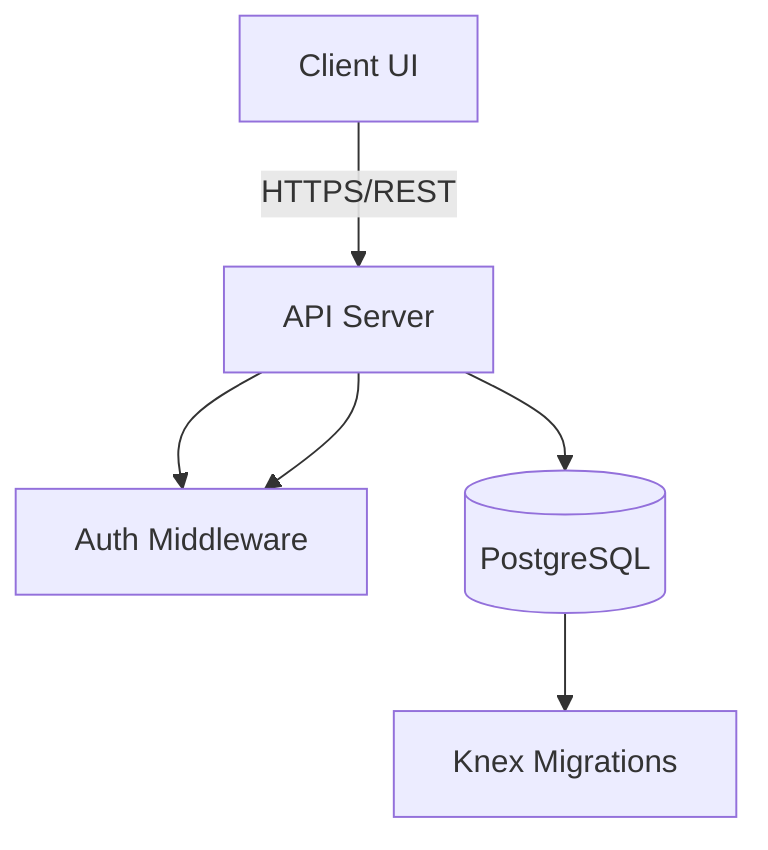

# ManForce ERP Architecture Documentation

## 1. High-Level Architecture
ManForce ERP is a full-stack, modular application designed to handle workforce management, compliance, and CRM operations.

### Component Diagram

---

## 2. Frontend Architecture (React + Vite)
The frontend follows a **Role-Based Routing** approach.
- **Routing**: Handled by `react-router-dom` in `App.jsx`.
- **Layouts**: `DashboardLayout` manages the sidebar, navigation, and persistent role-based UI constraints.
- **API Integration**: All backend requests are routed through `src/utils/api.js`, which encapsulates base URL configuration, JWT token injection, and error handling.
- **State Management**: Uses React hooks (`useState`, `useEffect`) to fetch and manage live database data.

---

## 3. Backend Architecture (Node.js + Express)
The backend is structured into domain-specific modules:
- **Routes**: API endpoint definitions (e.g., `routes/workers.js`).
- **Controllers**: Business logic for each resource.
- **Config**: Database (`knex.js`) and documentation (Swagger) settings.
- **Middleware**: Authentication (JWT) and request handling (multer for uploads).

### Database Schema (PostgreSQL)
The application relies on a relational schema managed by `knex` migrations. 
- **Core Tables**: `users`, `workers`, `clients`.
- **Operations**: `deployments`, `attendance`, `payroll`, `invoices`, `leave_requests`.
- **CRM**: `crm_contacts`, `crm_deals`, `crm_activities`.
- **Compliance**: `documents` (with file management integration).

---

## 4. Security
- **Authentication**: Stateless JWT-based authentication. The frontend stores the token in `localStorage` and injects it into every API request header via the `api` utility interceptor.
- **File Management**: File uploads are secured and stored locally in the `backend/uploads` directory, served via `express.static`.

---

## 5. Development Workflow
1. **Migrations**: Define database schema changes in `backend/src/migrations`.
2. **Controller Logic**: Write entity-specific CRUD operations in `backend/src/controllers`.
3. **API Definition**: Register routes and document them using **OpenAPI/Swagger** decorators in `backend/src/routes`.
4. **Integration**: Fetch and consume endpoints in frontend pages using `src/utils/api.js`.
